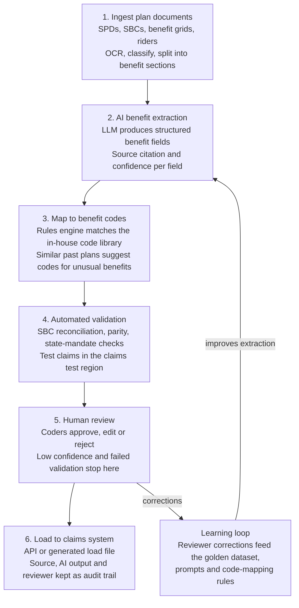

# Automated Medical Benefit Coding

AI-assisted benefit coding for health insurance benefit operations: an AI pipeline reads plan documents, extracts cost-sharing rules with source citations, maps them to claims-system codes, validates them automatically, and hands a coder a ready-to-approve plan.

**AI drafts and humans decide.** Nothing loads to the claims system without passing automated checks and a coder's approval.

> Confidential. For internal discussion. Source: *Implementation Plan: Prototype to Production* (October 2026).

| Phase | Duration | Outcome |
| --- | --- | --- |
| Phase 1: Prototype | 4 weeks | Live demo and scorecard; go/no-go decision |
| Phase 2: Production build | ~8 weeks after approval | Go-live on the first line of business |
| Total | ~3 months | Kickoff to production launch |

## Contents

- [Problem](#problem)
- [Solution](#solution)
- [Business case](#business-case)
- [Architecture](#architecture)
- [Delivery plan](#delivery-plan)
- [Phase 1: Prototype](#phase-1-prototype-weeks-1-to-4)
- [Phase 2: Production build](#phase-2-production-build-about-8-weeks)
- [Compliance and security](#compliance-and-security)
- [Testing and quality assurance](#testing-and-quality-assurance)
- [Success metrics](#success-metrics)
- [Risks and mitigations](#risks-and-mitigations)
- [Rollout and adoption](#rollout-and-adoption)
- [Approvals and support needed](#approvals-and-support-needed)

## Problem

Benefit coders translate each sold plan (SBC, SPD, benefit grid, riders) into claims-system parameters by hand. The process is slow at peak enrollment, depends on scarce experts, and causes payment errors when codes don't match what sales promised.

## Solution

A six-stage pipeline that turns plan documents into proposed benefit codes, each traceable to its source sentence, with a human approving everything that loads.

Targets for the production release:

- Review time for a standard plan under 15 minutes, versus hours today
- First-pass field accuracy of 90%+ on standard medical plans
- Every coded value traceable to its source sentence, with a full audit trail
- No increase in coding-related claim adjustments

## Business case

Manual coding is the bottleneck between a signed sale and a correctly paying plan. The prototype measures how much of it AI can remove.

| Pain point | Impact today | What the product changes |
| --- | --- | --- |
| Manual re-keying of plan documents | Hours per group, missed effective dates | AI drafts every field; coder reviews |
| Peak-season backlog | Overtime, contractors, late ID cards | Same coders handle more groups |
| Coding errors | Claim reprocessing, penalties, complaints | Automated SBC and test-claim checks before load |
| Inconsistent interpretation | Same benefit coded differently | One rules library applied every time |
| Sales promises not reflected in system | Post-sale disputes, renewal churn | Mismatches flagged before go-live |

### Value model

To be filled in with baseline numbers gathered in week 1 of the prototype:

- **Hours saved** = groups per year × hours per group today × share of work automated
- **Error savings** = coding-related adjustments per year × cost per adjustment × reduction
- **Revenue timing** = earlier effective dates on new groups

Because the build is lean (about 3 months end to end), the main costs are LLM usage, hosting, and coder review time for validation.

## Architecture

| Stage | What happens |
| --- | --- |
| 1. Ingest | Plan documents arrive from sales intake; OCR, document-type classification, split into benefit sections |
| 2. Extract | LLM turns each section into structured benefit fields, each with a source passage and confidence score |
| 3. Map | Rules engine matches fields to the in-house code library; similar past plans suggest codes for unusual benefits |
| 4. Validate | SBC reconciliation, parity and state-mandate checks; test claims adjudicated in the claims test region |
| 5. Review | Coders approve, edit or reject; low-confidence fields and failed validations always stop here |
| 6. Load | Approved codes loaded by API or generated load file; source, AI output and reviewer kept as an audit trail |

The prototype builds stages 1 to 5 against sample data with a simulated claims calculator. The production build adds the real claims-system load (stage 6), the learning loop, and enterprise hardening.

## Delivery plan

| Phase | When | Focus |
| --- | --- | --- |
| Prototype, week 1 | Weeks 1 to 4 | Data and setup |
| Prototype, week 2 | | AI extraction |
| Prototype, week 3 | | Mapping, checks, UI |
| Prototype, week 4 | | Tune and live demo |
| **Approval gate** | End of week 4 | Demo meets criteria |
| Sprint 1 | Build weeks 1-2 | Secure environment, CI/CD, full code library |
| Sprint 2 | Build weeks 3-4 | Claims-system integration, full benefit set and checks |
| Sprint 3 | Build weeks 5-6 | Review queue, audit trail, learning loop, intake form |
| Sprint 4 | Build weeks 7-8 | Regression, sign-off, UAT, parallel run, go-live |
| **Go-live** | | First line of business, then hypercare |

The approval gate is the only decision point. If the demo misses its criteria, the scorecard shows which fields need work before the build is reconsidered.

## Phase 1: Prototype (weeks 1 to 4)

The prototype shows AI turning 25 real plan documents into proposed benefit codes, with citations, a review screen, and simulated claim outcomes. It ends in a go/no-go demo.

### Scope

- 25 historical small-group medical plans with verified codes (15 simple, 10 moderate)
- About 20 fields per plan: in- and out-of-network deductibles and OOP max, PCP and specialist copays, preventive, ER, urgent care, inpatient, outpatient surgery, imaging, Rx tiers 1 to 4, prior auth flags
- Plan documents only, no member PHI, on a HIPAA-eligible LLM service under a BAA
- **Out of scope:** live claims-system integration, custom plans, dental and vision

### Prototype stack

- Enterprise LLM with structured JSON output for extraction
- Python service for parsing, OCR, extraction, and code mapping
- Code library as a simple lookup table (field, value, system code)
- Lightweight web review screen: source document beside proposed fields and codes
- Rules-based cost calculator standing in for the claims system, pricing 8 claim scenarios per plan

### Weekly plan

| Week | Focus | Deliverable |
| --- | --- | --- |
| 1 | Data and setup | 25 plans and verified codes collected; field list and code table agreed; environment approved; baseline review time measured |
| 2 | Extraction | All fields extracted with citations and confidence; first accuracy report |
| 3 | Mapping, checks, review screen | Fields mapped to codes; SBC reconciliation and claim calculator working; review screen usable |
| 4 | Tune and demo | Misses fixed; final scorecard; coders time their reviews; live demo |

### Demo script (20 minutes)

1. Upload an SBC the system has never seen.
2. Fields populate, each with a confidence score and its highlighted source sentence.
3. Low-confidence fields are flagged, and a seeded SBC mismatch is caught.
4. A coder edits one field and approves; the audit trail records the change.
5. Test claims (preventive, specialist, ER, MRI, generic and specialty Rx) show member cost for each.
6. Close on the scorecard: accuracy by field, review time versus today, plans needing no edits.

### Approval criteria for Phase 2

| Measure | Target |
| --- | --- |
| Field accuracy, simple plans | 90%+ |
| Field accuracy, moderate plans | 80%+ |
| Fields with a valid source citation | 100% |
| Review time per simple plan | Under 15 minutes |
| Seeded SBC mismatches caught | All |
| Coder verdict | Majority would use it daily |

## Phase 2: Production build (about 8 weeks)

Phase 2 turns the prototype into a secure, integrated product in four 2-week sprints, ending with go-live on the first line of business.

| Sprint | Weeks | Focus | Done when |
| --- | --- | --- | --- |
| 1 | 1-2 | Production foundations | Secure environment with SSO, encryption, logging, CI/CD; prototype refactored into services; full code library loaded |
| 2 | 3-4 | Claims integration and full benefit set | Codes load to the claims test region by API or load file; full medical and Rx benefit set covered; parity and state-mandate checks live |
| 3 | 5-6 | Reviewer workflow and learning loop | Work queue, approvals, audit trail, and reporting dashboard; reviewer corrections captured to improve accuracy; standard intake form for sales |
| 4 | 7-8 | Hardening and launch | Regression suite on a 200-plan golden set; security and compliance sign-off; coder UAT and parallel run; go-live and hypercare |

### Production-ready checklist

- [ ] Runs in the firm's approved cloud with SSO and role-based access
- [ ] BAA in place with the LLM provider; no data retained for model training
- [ ] Model and prompt versions pinned; changes go through regression tests
- [ ] Every coded field stores source passage, confidence, reviewer, and timestamp
- [ ] Automated SBC reconciliation and test claims block bad loads
- [ ] Monitoring and alerts for errors, latency, and accuracy drift
- [ ] Runbook, fallback to manual coding, and support process documented
- [ ] Coders trained; two-week parallel run passed before cutover

> **Timing note:** Go-live should avoid the October to January enrollment peak. If approval lands late, launch on off-cycle groups first.

## Compliance and security

The prototype avoids member PHI entirely. The production build adds the controls needed to pass HIPAA and model-risk review before go-live.

| Requirement | Prototype | Production |
| --- | --- | --- |
| HIPAA | Plan documents only, BAA with LLM provider | Encryption at rest and in transit, access logging, minimum necessary access |
| ACA / SBC consistency | SBC reconciliation demonstrated | Mismatch blocks the load |
| Mental health parity (MHPAEA) | Not in scope | Automated cost-sharing comparison |
| State mandates | Not in scope | Rules for situs states of the first LOB |
| AI controls | Citations and confidence per field | Plus pinned versions, regression gates, human approval on every plan |
| Audit and retention | Basic change log | Source, AI output, reviewer decision, final code kept together |
| Model risk | Informal review | Documentation aligned with the firm's model governance policy |

## Testing and quality assurance

A coded plan passes only when test claims pay exactly as the plan document says they should.

1. **Golden dataset.** 25 verified plans for the prototype, grown to 200 for production, covering simple and moderate designs. Every change is scored against it.
2. **Field-level accuracy.** Precision and recall per field (deductible, copay, coinsurance, OOP max, prior auth, Rx tiers), not just an overall score.
3. **Test claims.** Standard scenarios per plan (preventive, specialist, ER, MRI, generic and specialty Rx, out-of-network) must produce the expected member cost.
4. **SBC reconciliation.** Coded values compared to the issued SBC line by line; any mismatch blocks the load.
5. **Parallel run.** For two weeks before cutover, coders code new groups both ways; outputs are compared.
6. **Post-launch audit.** Sample 10% of approved plans monthly and track claim adjustments traced to coding.

## Success metrics

Speed gains count only if accuracy holds. A faster process with more claim adjustments is a failure.

| Metric | Prototype (week 4) | Production launch | 3 months after launch |
| --- | --- | --- | --- |
| First-pass field accuracy | 85%+ overall | 90%+ | 95% |
| Review time per standard plan | Under 15 min | Under 15 min | Under 10 min |
| Plans needing no edits | Measured | 30% | 50% |
| SBC mismatch rate at load | Seeded errors caught | Under 2% | Under 0.5% |
| Coding-related claim adjustments | n/a | No increase | 30% reduction |
| Groups per coder | Baseline | 1.5x | 2x |
| Coder adoption on launch LOB | Positive verdict | 80% of new groups | 95% of new groups |

## Risks and mitigations

The two biggest risks are a wrong code reaching production and an 8-week build slipping. Scope is kept tight to protect against both.

| Risk | Mitigation |
| --- | --- |
| AI misreads or invents a benefit value | Source citation per field, confidence thresholds, human approval on every plan, test claims before load |
| Claims system has no usable API | Confirm in prototype week 1; fall back to generated load files |
| Tight timeline slips | Fixed scope: one LOB, standard medical plans; anything else moves to a later release |
| Delays waiting on data, SMEs, or approvals | Secure plan samples, coder time, and security review dates before kickoff |
| Messy source documents (scans, broker spreadsheets) | OCR quality check; unreadable documents route to manual coding |
| Coder resistance | Coders validate outputs from week 1 and shape the review screen |
| LLM provider changes model behavior | Pin model versions; rerun regression suite before any upgrade |
| Launch collides with enrollment peak | Go live on off-cycle groups; no cutover October to January |

## Rollout and adoption

The product launches on one line of business, proves itself for a month, then expands.

**Benefit coders**

- Involved from prototype week 1 as validators of AI output
- Roles shift toward review, exceptions, and QA rather than data entry
- Accuracy dashboards shared openly so trust is earned with data

**Sales and account management**

- Standard digital intake form replaces free-form emails and spreadsheets
- Reps see setup status for each sold group
- A later release adds a codeability check at quote stage, flagging benefits the claims system can't support before the proposal goes out

**Expansion after launch**

Add lines of business one at a time, then complex plans, dental, and vision, each gated by the same accuracy targets.

## Approvals and support needed

To start the prototype:

- [ ] Sponsor approval for the 4-week prototype
- [ ] Access to 25 historical plans with verified codes (SBCs, grids, current system codes)
- [ ] A few hours a week from two senior benefit coders to validate output
- [ ] Approved HIPAA-eligible LLM environment under a BAA
- [ ] Demo date booked with decision makers for the end of week 4

To start the production build (after the demo):

- [ ] Go decision based on the approval criteria
- [ ] Claims-system test region access and integration contact
- [ ] Security and compliance review dates booked for weeks 6 to 8
- [ ] Launch line of business and go-live window confirmed

## Glossary

| Term | Meaning |
| --- | --- |
| SBC | Summary of Benefits and Coverage |
| SPD | Summary Plan Description |
| OOP max | Out-of-pocket maximum |
| LOB | Line of business |
| BAA | Business Associate Agreement |
| PHI | Protected health information |
| MHPAEA | Mental Health Parity and Addiction Equity Act |
| UAT | User acceptance testing |
