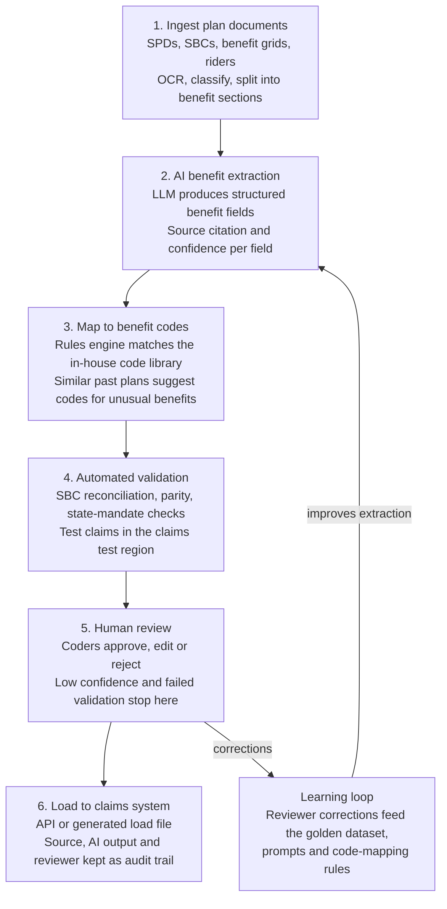

# Architecture

**AI drafts and humans decide.** Nothing loads to the claims system without passing automated checks and a coder's approval.

| Stage | What happens |
| --- | --- |
| 1. Ingest | Plan documents arrive from sales intake; OCR, document-type classification, split into benefit sections |
| 2. Extract | LLM turns each section into structured benefit fields, each with a source passage and confidence score |
| 3. Map | Rules engine matches fields to the in-house code library; similar past plans suggest codes for unusual benefits |
| 4. Validate | SBC reconciliation, parity and state-mandate checks; test claims adjudicated in the claims test region |
| 5. Review | Coders approve, edit or reject; low-confidence fields and failed validations always stop here |
| 6. Load | Approved codes loaded by API or generated load file; source, AI output and reviewer kept as an audit trail |

## Services by stage

| Stage | Prototype (built or planned) | Status |
| --- | --- | --- |
| Document store | Azure Blob Storage (`medbencodingf946de69` / `prototype-docs`); sources are the CMS Exchange Public Use Files and insurer websites | Built |
| 1. Ingest | Azure Document Intelligence (`prebuilt-read`) reads every document, digital or scanned; rule-based classification and section splitting | Built |
| 2. Extract | Azure OpenAI (`gpt-5-mini`, deployment `extract` on the `medbencoding-ai` resource) with structured JSON output | Built |
| 3. Map | Code library and coded plans in Azure Table Storage (`codelibrary` and `codedplans` tables in `medbencodingf946de69`); mapping rules run in the pipeline process | Built |
| 4. Validate | Local rules-based cost calculator and SBC reconciliation; no external service planned | Not built |
| 5. Review | Lightweight web review screen, run locally | Not built |
| 6. Load | Client claims system by API or load file | Production phase |

Resource names, API versions and cost notes are in [pipeline.md](pipeline.md#services-used).

The prototype builds stages 1 to 5 against sample data with a simulated claims calculator. The production build adds the real claims-system load (stage 6), the learning loop, and enterprise hardening.

See the [implementation plan](implementation-plan.md) for delivery phases, compliance, testing, and success metrics.
